<div align="center">

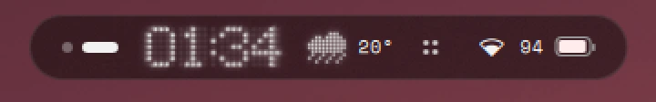

# Everything

**Hyprland, riced around one pill.**<br>
A Nothing OS–style Quickshell desktop: dot-matrix type, black glass, and one small spark of colour.

[](https://hyprland.org)
[](https://quickshell.org)
[](#install)
[](LICENSE)

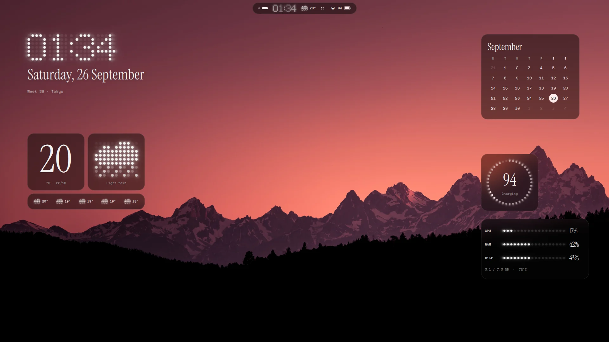

</div>

> *Quiet, precise hardware: black glass, white dot-matrix light, and one small
> spark of colour. Nothing on screen that doesn't need to be there.*
> — [INTENT.md](config/quickshell/nothing/INTENT.md)

## Install

Arch Linux and derivatives (CachyOS, EndeavourOS, Garuda, Manjaro…):

```sh
bash <(curl -fsSL https://raw.githubusercontent.com/SambuddhaRoy/Everything-dots/main/install.sh)
```

Then log into the Hyprland session. A short welcome tour walks you through
wallpaper, look, colour and weather, and `Super + /` shows every key.

<details>
<summary>What the installer does</summary>

- **Packages:** official repos first, AUR as a fallback (it installs `yay` if needed). It asks before installing anything unless you pass `--yes`.
- **Fonts:** Instrument Serif and Space Mono (OFL).
- **Configs:** symlinks everything into `~/.config`. Whatever it replaces is backed up to `~/.config/everything-dots-backup/`.
- **Setup:** enables NetworkManager and Bluetooth, makes a default dot-matrix wallpaper if the folder is empty, and generates the theme.
- **Updates:** installs a systemd user timer that keeps the dots up to date.

Options: `--yes` · `--no-packages` · `--no-autoupdate` · `--link-only`

</details>

<details>
<summary>Plays well with other desktops</summary>

Install it next to KDE Plasma, niri, GNOME or anything else, and pick
Hyprland at the login screen.

- **Touches only two folders:** `~/.config/hypr` and `~/.config/quickshell/nothing`. An existing Hyprland config is moved aside whole to `~/.config/everything-dots-backup/`, never merged into.
- **Leaves everything else alone:** Plasma and niri configs, other Quickshell shells (such as a niri shell), and kitty, fuzzel, GTK and matugen setups.
- **Stays inside the Hyprland session:**
  - Theming for kitty, fuzzel and Qt lives only in the Hyprland session.
  - Only a handful of variables go to the systemd user session (the ones portals need), so nothing leaks into your other desktops.
- **The updater is session-aware:** it only reloads a *running* Hyprland session. Restarts go through `qs kill -c nothing`, which can't touch another desktop's shell.
- **System services:** it won't enable NetworkManager if systemd-networkd, iwd or connman already manage your network, and won't replace PulseAudio.

</details>

<details>
<summary>How updates work</summary>

`everything-dots-update.timer` runs every 6 hours (and 10 minutes after boot):
- fast-forwards `~/Everything-dots`
- re-links the configs
- reloads Hyprland and restarts the shell

It skips the update if you've edited the repo, and never restarts while the screen is locked. If the installer itself changed (new packages), you get a notification instead of an unattended `sudo`.

Your settings aren't in the repo, so updates never touch them: `config.json`, `keybinds.json`, `hyprland.json`, and the generated colour and shape files.

</details>

## The pill

One island at the top of the screen that grows into whatever you open.

| | |
|:---:|:---:|
| 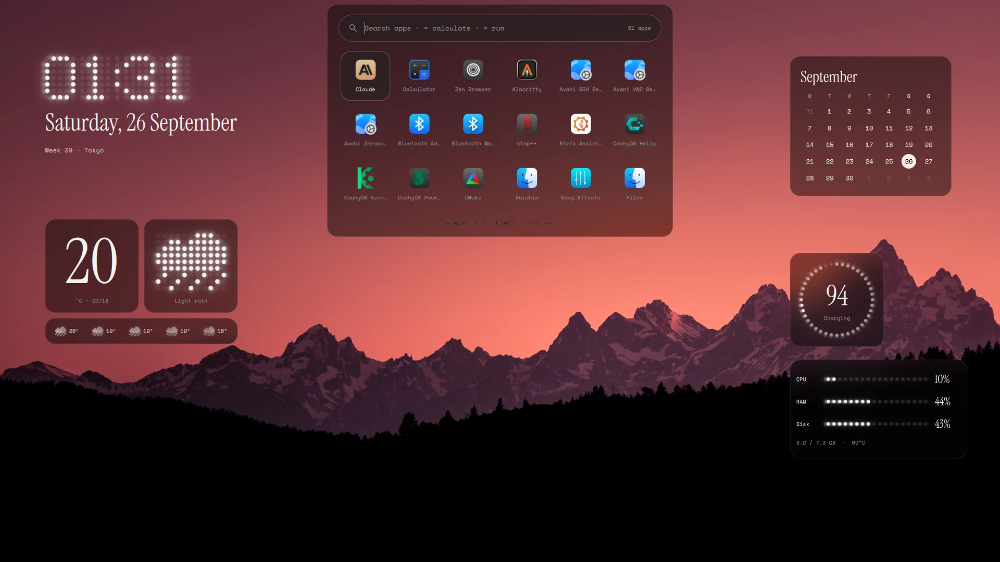 | 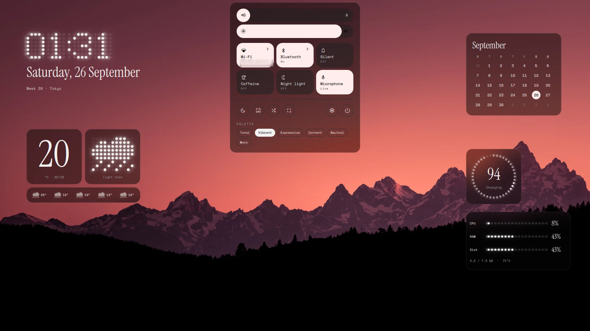 |
| **Launcher.** [vicinae](https://vicinae.com) (apps, clipboard, emoji, files, extensions), themed from the wallpaper. If vicinae isn't running, the pill's own launcher (shown) takes over. | **Quick settings.** Nothing-style tiles, pill sliders, palette, capture, power. |
| 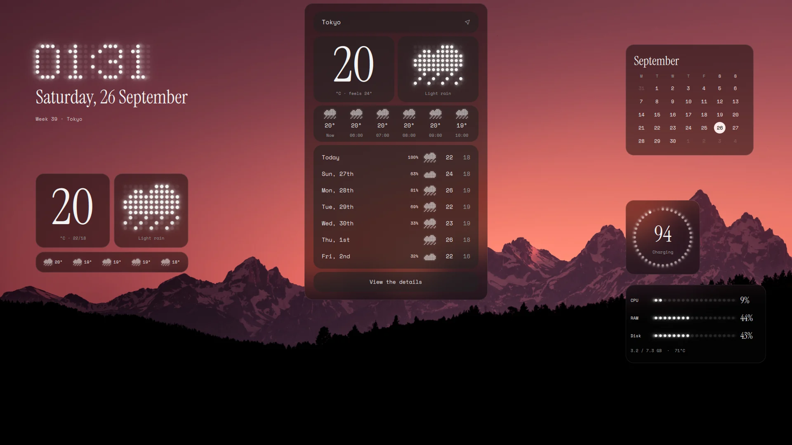 | 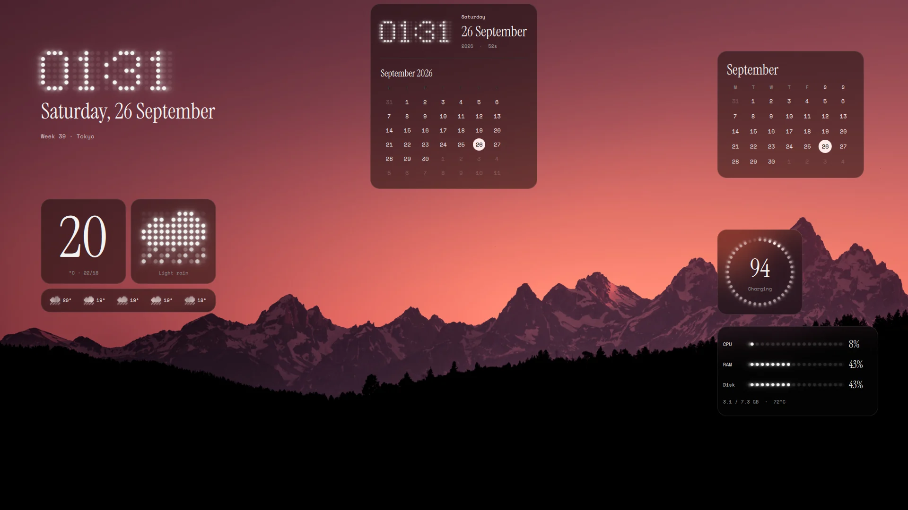 |
| **Weather.** Open-Meteo hourly and 7-day, animated dot-matrix glyphs. | **Calendar.** Dot-matrix clock, weekends in the accent colour. |
| 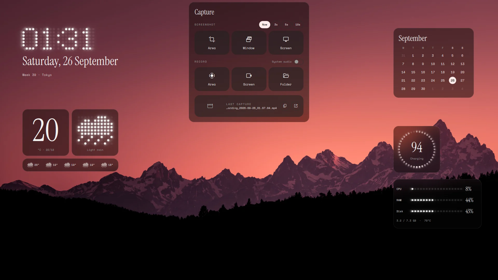 | 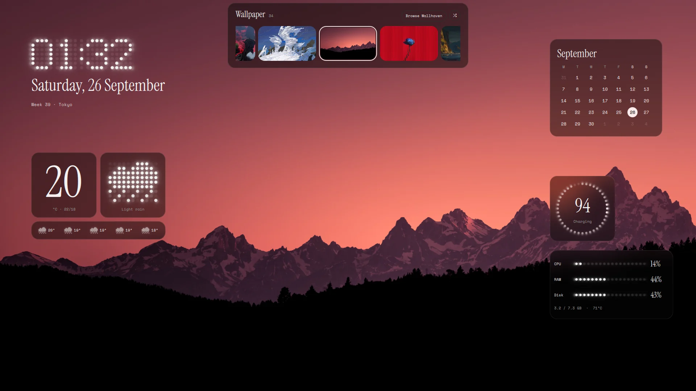 |
| **Capture.** Screenshots of an area, window or screen (with a delay), and recording with system audio. | **Wallpapers.** From your folder, or browse Wallhaven straight from Settings. |

The pill also holds:
- **Media:** tinted by the cover art, with a live dot-matrix waveform and a seekable dot progress bar.
- **Networks:** Wi-Fi and Bluetooth, with tray menus inside the pill.
- **The rest:** polkit password prompts, notifications, and volume and brightness popups.

## Lock screen, widgets, keys

| | |
|:---:|:---:|
| 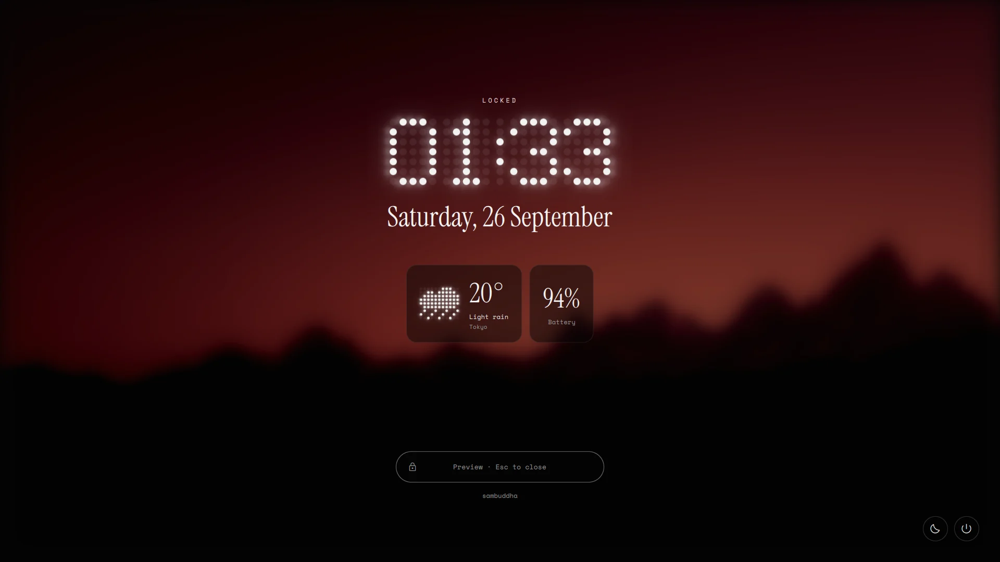 | 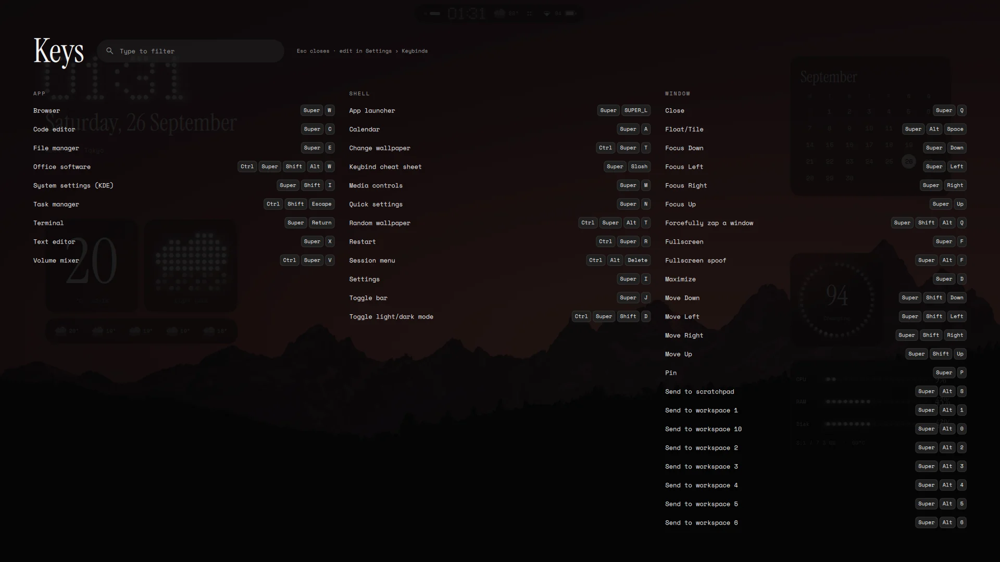 |
| **Lock screen.** Dot-matrix clock, glass cards, PAM login. hyprlock is the fallback. | **`Super + /`** shows every bind, live from Hyprland. Edit them in Settings. |

Desktop widgets: clock, weather, now playing, calendar, a battery ring (the
dots chase while charging), system meters and a sticky note. All of them can be dragged.

## Make it yours

| | |
|:---:|:---:|
| 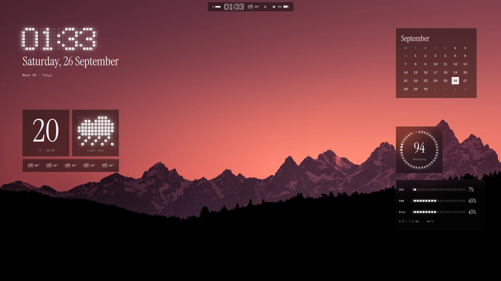 | 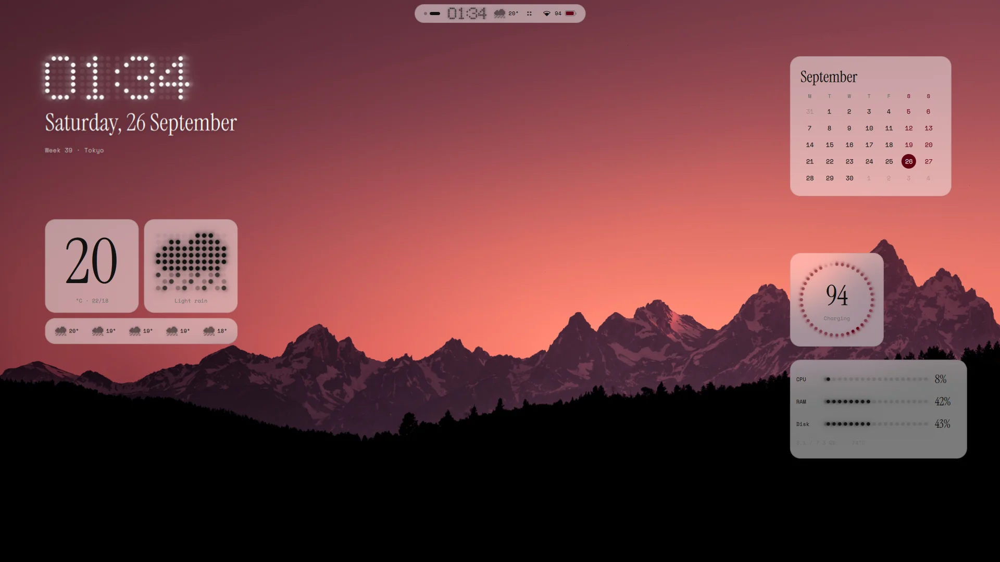 |
| **Brutalist.** One switch removes every rounded corner and squares the dots. | **Light.** White glass, same rules. |
| 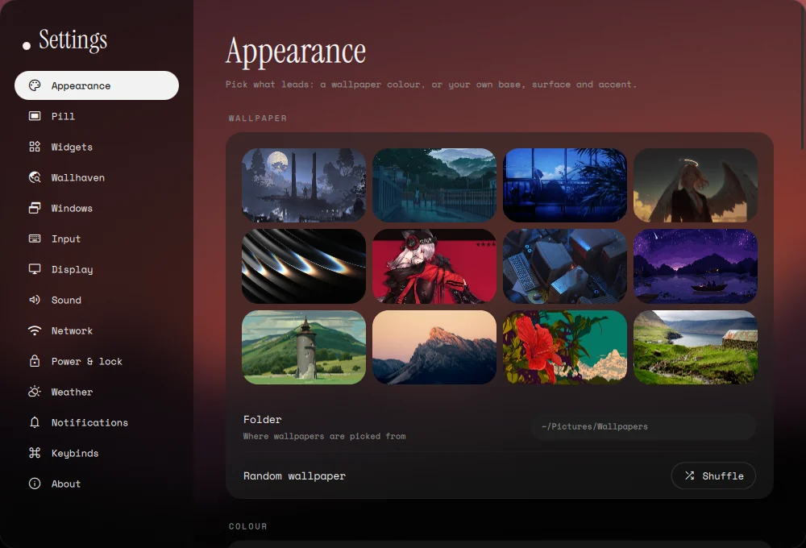 | 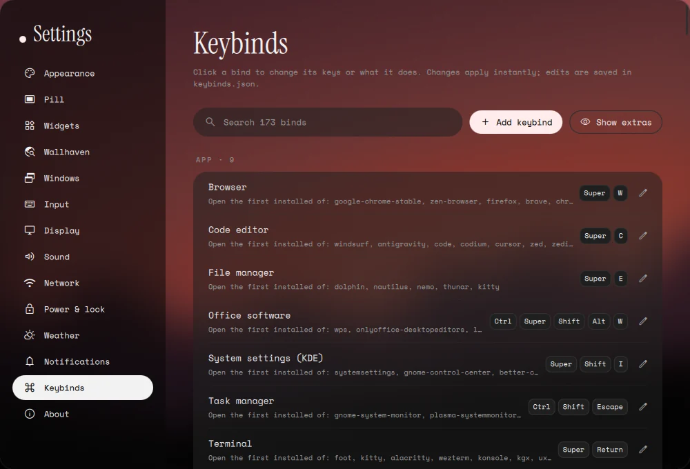 |
| **Settings** (`Super + I`). 14 pages, from window gaps to per-app volume. | **Keybind editor.** Shows what every bind does. Rebind to apps, commands or actions. |

**Displays.**
- New monitors get their native resolution and a scale picked from the panel's DPI, so hi-DPI screens work out of the box, and every image in the shell is decoded at the screen's real pixel density.
- Settings › Display sets resolution, refresh rate, scale (auto or 1–3×), rotation and variable refresh per monitor.
- Colour: sRGB, wide gamut or HDR, 10-bit, SDR brightness and saturation under HDR, and ICC profiles.
- Every change reverts after 15 seconds unless you keep it.

**Colour.**
- The wallpaper decides, but you choose which of its colours leads, and surfaces stay neutral.
- Or pick a base, surface and accent yourself (presets included).
- Or let the album art of what's playing lead.

**Shape.** One corner radius and one gap everywhere, or none at all.

**Focus.** Unfocused windows turn to frosted glass instead of drawing borders.

<div align="center">
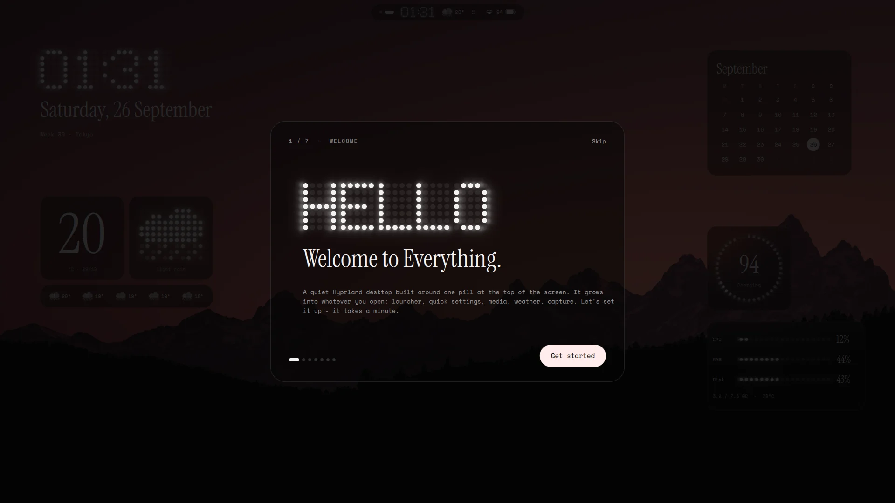
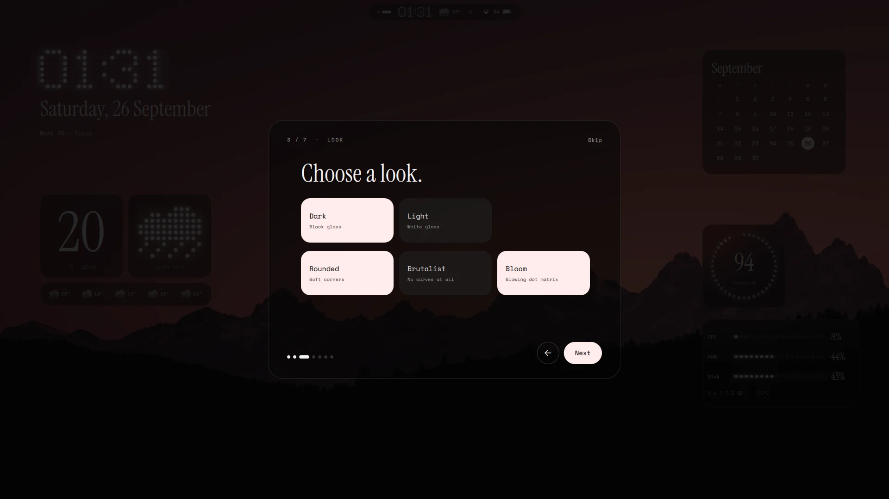
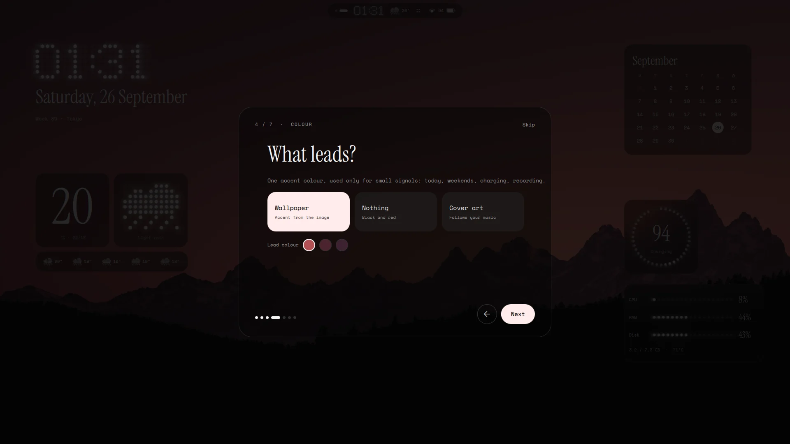
<br><sub>The first-run tour</sub>
</div>

## Keys

| Keys | |
|---|---|
| `Super` (tap) | launcher (vicinae) |
| `Super + V` · `Super + .` | clipboard history · emoji |
| `Super + /` | all keys |
| `Super + I` | settings |
| `Super + N` · `Super + M` · `Super + A` | quick settings · media · calendar |
| `Super + Print` | capture panel |
| `Super + Shift + S` | screenshot an area (saved and copied) |
| `Super + Shift + R` | record an area (press again to stop) |
| `Ctrl + Super + T` | wallpapers |
| `Super + L` | lock |
| `Ctrl + Alt + Delete` | power menu |

## Layout

```
config/hypr/                 Hyprland (Lua config)
config/quickshell/nothing/   the shell. Its README covers files, IPC and options
install.sh  update.sh        installer and auto-updater
assets/                      screenshots
```

## Credits

- Keybinds and helper scripts derive from
  [end-4/dots-hyprland](https://github.com/end-4/dots-hyprland) (GPL-3.0),
  so this repo is GPL-3.0 as well.
- Built with [Quickshell](https://quickshell.org) and
  [matugen](https://github.com/InioX/matugen).
- Fonts: Instrument Serif and Space Mono (SIL OFL).
- Weather: [Open-Meteo](https://open-meteo.com), with location lookup by [wttr.in](https://wttr.in).
- Wallpaper in the screenshots: from [Wallhaven](https://wallhaven.cc).
- Inspired by Nothing OS.
